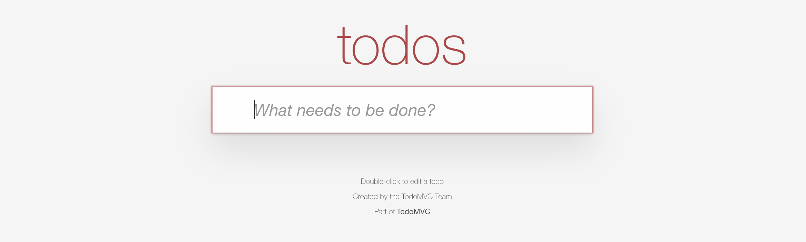
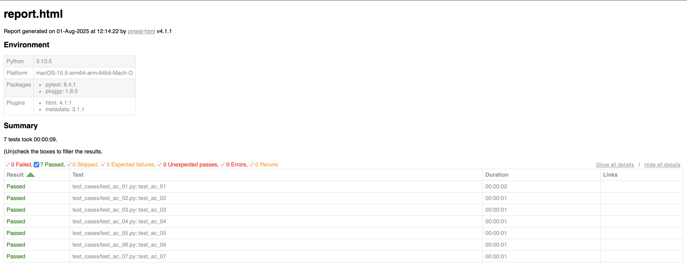
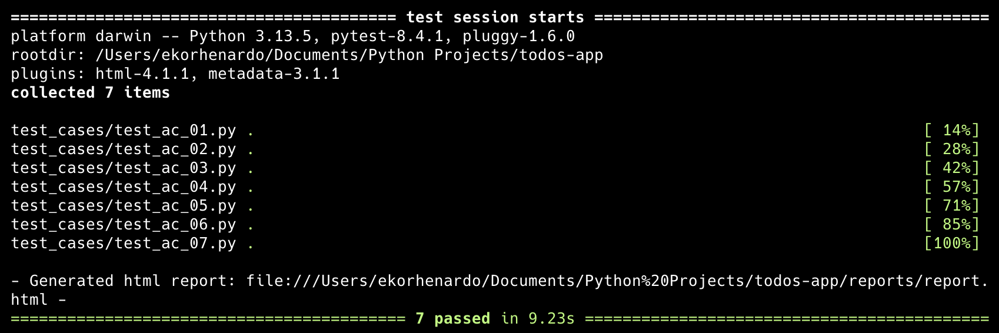

## Implementation Strategy



This project uses **Selenium** and **Python** to automate testing for the [TodoMVC](https://todomvc.com/examples/react/dist/) application. The goal is to simulate real user actions and check that key features work as expected.

### 1. Tools Used
- **Selenium**: To control the browser and interact with the UI (click, type, hover, etc.).
- **Pytest**: To organize and run the test cases with clear reporting.
- **webdriver-manager**: To automatically handle the ChromeDriver setup.

### 2. How the Tests Are Structured
- I used the **Page Object Model** to keep the element selectors and actions in one place.
- Test files call methods from the page class to keep things clean and reusable.

### 3. Interactions Covered
- **Add** todo by typing and pressing Enter.
- **Edit** todo using double click and type new text.
- **Mark** todo as completed by clicking the checkbox.
- **Delete** todo by clicking a hover-only delete button.
- **Filter** view by All, Active, or Completed.
- **Assert** UI state using class names and text content.

### 4. Assertion Strategy
- I used text content to confirm successful updates.
- I checked class names (like "completed") to confirm state changes.
- I also verified that certain elements appeared or disappeared after actions.
- I checked the display count number for all the active tasks as well.

### 5. Limitations and Excluded Edge Cases
This implementation focuses on core functional behaviors. The following edge cases are not covered:
- Page reload behavior or persistence across sessions.
- Maximum number of todos or performance at scale.
- Input validation for special characters, empty text, or very long strings.
- Keyboard-only navigation or accessibility scenarios.

## Project Setup

Follow these steps to set up the development environment.

### 1. Clone the Repository

```bash
git clone https://github.com/ekorhenardo/todos-app.git
cd todos-app
```

### 2. Install Python via pyenv

Make sure `pyenv` is installed and working.

Then install the required Python version:

```bash
pyenv install 3.13.5
pyenv local 3.13.5
```

### 3. Create a Virtual Environment

```bash
python -m venv .venv
source .venv/bin/activate
```

### 4. Install Dependencies

```bash
pip install -r requirements.txt
```

## Execute Test Cases

Type this command to run all the test cases:
```bash
pytest
```
If you want to run a specific test case, you can use this command:
```bash
pytest test_cases/test_ac_01.py
```
With above command, it will run only the test_ac_01.py test case. You can change the filename to run other specific test case.

## Acceptance Criteria

The following criteria were used to guide test case development for the `TodoMVC`:

### 1. AC01: User can add a new todo by typing in the input field and pressing Enter.

Precondition: No task in todos list.

Steps:
1. User input text `test automation`.
2. Press Enter.

Expected Result: New todo task will appear.

Assertion: The task appear with the text of `test automation`.

### 2. AC02: User can mark a todo as completed by clicking its checkbox.

Precondition: No task in todos list.

Steps:
1. User input text `test automation` and press Enter.
2. Checkmark the new task as completed.

Expected Result: The task will be updated to completed.

Assertion: The task will now updated with class `completed`.

### 3. AC03: User can delete a todo by clicking the "X" button.

Precondition: No task in todos list.

Steps:
1. User input text `test automation` and press Enter.
2. Hover to the task and click "X" button.

Expected Result: The task will be deleted and disappear from the todos list.

Assertion: Get the count of task from the list, the count should be equal to 0.

### 4. **AC04**: Completed todos can be cleared using the "Clear completed" button.

Precondition: No task in todos list.

Steps:
1. User input 2 new tasks.
2. Mark one of the task as completed.
3. Click the `Clear completed` button on the bottom right corner.

Expected Result: Only the completed task will be deleted, the active task will remain in the todos list.

Assertion: Check the count of task from todos list, the count should be equal to 1.

### 5. **AC05**: The list should reflect correct count of active items.

Precondition: No task in todos list.

Steps:
1. User input 3 new tasks.
2. Mark one of the task as completed.

Expected Result: There will be a text `2 item left!` in the bottom left corner.

Assertion: Check the count of active task from the display, the number should be equal to 2.

### 6. **AC06**: Filters (All, Active, Completed) should change the displayed list accordingly.

Precondition: No task in todos list.

Steps:
1. User input 3 new tasks.
2. Mark one of the task as completed.
3. Use `Active` filter.
4. Use `Completed` filter.

Expected Result: 3 item should appear in `All` filter, 2 item should appear in `Active` filter and 1 item should appear in `Completed` filter.

Assertion: Get the count of task from each page filter and compare with expected result.

### 7. **AC07**: User can edit a todo by double clicking the input field and save the changes by pressing Enter.

Precondition: No task in todos list.

Steps:
1. User input text `test automation` and press Enter.
2. Double click the new task to edit.
3. Add a text of `edited` and press Enter.

Expected Result: The text of the task will be updated.

Assertion: The task will be updated with the text of `test automation edited`.

## Test Report

You can view the full test result [here](reports/report.html).


